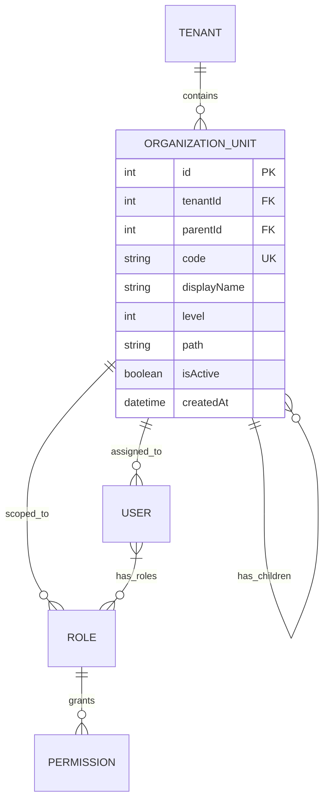

# Organization Hierarchy System Implementation Plan

## Overview

Add a **multi-level organizational hierarchy system** to support enterprise structures like:
```
Tata Group (Holding Company)
├── Titan (Subsidiary)
│   ├── Watches Division
│   │   ├── Sales Team
│   │   └── Marketing Team
│   └── Jewelry Division
├── Tata Motors
│   ├── Commercial Vehicles
│   └── Passenger Vehicles
└── TCS (Tata Consultancy Services)
```

This enables selling your SaaS to large enterprises with complex organizational structures while maintaining RBAC integration.

---

## Current State Analysis

### ✅ Existing Assets to Leverage

| Component | Location | Reuse Strategy |
|-----------|----------|----------------|
| [TreeService](file:///d:/angular/src/app/shared/services/tree.service.ts#17-230) | [tree.service.ts](file:///d:/angular/src/app/shared/services/tree.service.ts) | Extend for org tree operations |
| [PermissionComponent](file:///d:/angular/src/app/shared/components/permission/permission.component.ts#14-106) | [permission.component.ts](file:///d:/angular/src/app/shared/components/permission/permission.component.ts) | Pattern for org tree UI |
| PrimeNG Tree | Already imported | Use for org visualization |
| [RoleComponent](file:///d:/angular/src/app/pages/administration/components/role/role.component.ts#17-270) | [role.component.ts](file:///d:/angular/src/app/pages/administration/components/role/role.component.ts) | Pattern for CRUD dialogs |

### ❌ What's Missing

- Organization Unit (OU) data model
- OU management service & API integration
- OU hierarchy visualization component
- User-to-OU assignment
- Role scoping to OU levels
- OU-based data filtering

---

## Architecture Design

### Data Model Hierarchy



### Organization Unit Model

```typescript
interface OrganizationUnit {
  id: number;
  tenantId: number;
  parentId: number | null;           // null = root level
  code: string;                       // Unique hierarchical code: "001.002.001"
  displayName: string;                // "Titan Watches Division"
  level: number;                      // 0 = root, 1, 2, 3... depth
  path: string;                       // "/1/5/12/" - ancestry path for queries
  memberCount?: number;               // Users in this OU
  childCount?: number;                // Direct children count
  isActive: boolean;
  createdAt: string;
  updatedAt: string;
}
```

---

## Proposed Changes

### Phase 1: Core Models & Services

---

#### [NEW] [organization.model.ts](file:///d:/angular/src/app/pages/models/api/organization.model.ts)

Organization Unit interfaces and response types:
- `OrganizationUnit` - Core OU model
- `OrganizationUnitTree` - Extended with children array
- `GetAllOrganizationUnitsResponse` - Paginated list response
- `OrganizationUnitResponse` - Single OU response
- `MoveOrganizationUnitInput` - For drag-drop reordering
- `AssignUserToOUInput` - User assignment payload

---

#### [NEW] [organization.service.ts](file:///d:/angular/src/app/pages/services/api/organization.service.ts)

API service with methods:
- [getAll(input)](file:///d:/angular/src/app/pages/administration/components/user/user.component.ts#183-188) - Get flat list with pagination
- `getTree(parentId?)` - Get hierarchical tree structure
- `getById(id)` - Get single OU details
- [create(input)](file:///d:/angular/src/app/pages/administration/components/role/role.component.ts#172-175) - Create new OU
- [update(input)](file:///d:/angular/src/app/shared/services/permission.service.ts#217-227) - Update OU
- [delete(id)](file:///d:/angular/src/app/pages/administration/components/role/role.component.ts#184-203) - Delete OU (with children check)
- `move(input)` - Move OU to new parent
- `getUsers(ouId)` - Get users in OU
- `assignUser(ouId, userId)` - Assign user to OU
- `removeUser(ouId, userId)` - Remove user from OU

---

#### [MODIFY] [api.route.ts](file:///d:/angular/src/app/utils/routes/api.route.ts)

Add organization unit API routes:
```typescript
// Organization Units
getAllOrganizationUnits: 'api/services/app/OrganizationUnit/GetAll',
getOrganizationUnitTree: 'api/services/app/OrganizationUnit/GetTree',
createOrganizationUnit: 'api/services/app/OrganizationUnit/Create',
updateOrganizationUnit: 'api/services/app/OrganizationUnit/Update',
deleteOrganizationUnit: 'api/services/app/OrganizationUnit/Delete',
moveOrganizationUnit: 'api/services/app/OrganizationUnit/Move',
getOrganizationUnitUsers: 'api/services/app/OrganizationUnit/GetUsers',
assignUserToOrganizationUnit: 'api/services/app/OrganizationUnit/AddUser',
removeUserFromOrganizationUnit: 'api/services/app/OrganizationUnit/RemoveUser',
```

---

### Phase 2: UI Components

---

#### [NEW] Organization Unit Tree Component

Path: `src/app/shared/components/organization-tree/`

Files:
- `organization-tree.component.ts`
- `organization-tree.component.html`
- `organization-tree.component.scss`

Features:
- Hierarchical tree visualization using PrimeNG Tree
- Expand/collapse nodes
- Drag-and-drop reordering
- Context menu (Add Child, Edit, Delete, Move)
- Search/filter capability
- User count badges

---

#### [NEW] Organization Management Page

Path: `src/app/pages/administration/components/organization/`

Files:
- `organization.component.ts`
- `organization.component.html`
- `organization.component.scss`

Features:
- Split view: Tree on left, details on right
- Create/Edit OU dialog
- Delete confirmation with child warning
- User assignment panel
- Role scoping to OU

---

#### [MODIFY] [administration.routes.ts](file:///d:/angular/src/app/pages/administration/administration.routes.ts)

Add organization route:
```typescript
{
  path: LOCAL_ROUTES.ORGANIZATION,
  loadComponent: () => import('./components/organization/organization.component')
    .then(m => m.OrganizationComponent)
}
```

---

#### [MODIFY] [local.route.ts](file:///d:/angular/src/app/utils/routes/local.route.ts)

Add organization route constant:
```typescript
ORGANIZATION: 'organization'
```

---

### Phase 3: User-OU Integration

---

#### [MODIFY] [users.model.ts](file:///d:/angular/src/app/pages/models/api/users.model.ts)

Extend user model with OU:
```typescript
interface UsersModel {
  // ... existing fields
  organizationUnitId?: number;
  organizationUnitName?: string;  // For display
}
```

---

#### [MODIFY] [user.component.ts](file:///d:/angular/src/app/pages/administration/components/user/user.component.ts)

Add OU assignment:
- Add OU dropdown/tree-select to user form
- Display OU in user table columns
- Filter users by OU

---

### Phase 4: Role-OU Scoping (Advanced)

---

#### [MODIFY] [roles.model.ts](file:///d:/angular/src/app/pages/models/api/roles.model.ts)

Extend role model:
```typescript
interface RolesModel {
  // ... existing fields
  organizationUnitId?: number;     // Scoped to OU (null = tenant-wide)
  organizationUnitName?: string;
  isInherited?: boolean;           // Inherited from parent OU
}
```

---

## Backend API Specification

> [!IMPORTANT]
> Share this section with your backend developer

### 1. Get Organization Tree

**Endpoint**: `GET /api/services/app/OrganizationUnit/GetTree`

**Query Parameters**:
| Parameter | Type | Required | Description |
|-----------|------|----------|-------------|
| `parentId` | number | No | Get children of this OU (null = root) |
| `includeInactive` | boolean | No | Include inactive OUs |

**Response**:
```json
{
  "result": {
    "items": [
      {
        "id": 1,
        "tenantId": 1,
        "parentId": null,
        "code": "001",
        "displayName": "Tata Group",
        "level": 0,
        "path": "/1/",
        "memberCount": 5,
        "childCount": 3,
        "isActive": true,
        "children": [
          {
            "id": 2,
            "tenantId": 1,
            "parentId": 1,
            "code": "001.001",
            "displayName": "Titan",
            "level": 1,
            "path": "/1/2/",
            "memberCount": 150,
            "childCount": 2,
            "isActive": true,
            "children": [
              {
                "id": 5,
                "tenantId": 1,
                "parentId": 2,
                "code": "001.001.001",
                "displayName": "Watches Division",
                "level": 2,
                "path": "/1/2/5/",
                "memberCount": 80,
                "childCount": 2,
                "isActive": true,
                "children": [
                  {
                    "id": 10,
                    "tenantId": 1,
                    "parentId": 5,
                    "code": "001.001.001.001",
                    "displayName": "Sales Team",
                    "level": 3,
                    "path": "/1/2/5/10/",
                    "memberCount": 45,
                    "childCount": 0,
                    "isActive": true,
                    "children": []
                  },
                  {
                    "id": 11,
                    "tenantId": 1,
                    "parentId": 5,
                    "code": "001.001.001.002",
                    "displayName": "Marketing Team",
                    "level": 3,
                    "path": "/1/2/5/11/",
                    "memberCount": 35,
                    "childCount": 0,
                    "isActive": true,
                    "children": []
                  }
                ]
              },
              {
                "id": 6,
                "tenantId": 1,
                "parentId": 2,
                "code": "001.001.002",
                "displayName": "Jewelry Division",
                "level": 2,
                "path": "/1/2/6/",
                "memberCount": 70,
                "childCount": 0,
                "isActive": true,
                "children": []
              }
            ]
          },
          {
            "id": 3,
            "tenantId": 1,
            "parentId": 1,
            "code": "001.002",
            "displayName": "Tata Motors",
            "level": 1,
            "path": "/1/3/",
            "memberCount": 500,
            "childCount": 2,
            "isActive": true,
            "children": []
          },
          {
            "id": 4,
            "tenantId": 1,
            "parentId": 1,
            "code": "001.003",
            "displayName": "TCS",
            "level": 1,
            "path": "/1/4/",
            "memberCount": 10000,
            "childCount": 0,
            "isActive": true,
            "children": []
          }
        ]
      }
    ]
  },
  "targetUrl": null,
  "success": true,
  "error": null,
  "unAuthorizedRequest": false,
  "__abp": true
}
```

---

### 2. Get All Organization Units (Flat)

**Endpoint**: `GET /api/services/app/OrganizationUnit/GetAll`

**Query Parameters**:
| Parameter | Type | Required | Description |
|-----------|------|----------|-------------|
| `Keyword` | string | No | Search filter |
| `MaxResultCount` | number | No | Page size |
| `SkipCount` | number | No | Pagination offset |

**Response**:
```json
{
  "result": {
    "totalCount": 11,
    "items": [
      {
        "id": 1,
        "tenantId": 1,
        "parentId": null,
        "code": "001",
        "displayName": "Tata Group",
        "level": 0,
        "path": "/1/",
        "memberCount": 5,
        "isActive": true,
        "createdAt": "2026-01-01T00:00:00Z",
        "updatedAt": "2026-01-01T00:00:00Z"
      },
      {
        "id": 2,
        "tenantId": 1,
        "parentId": 1,
        "code": "001.001",
        "displayName": "Titan",
        "level": 1,
        "path": "/1/2/",
        "memberCount": 150,
        "isActive": true,
        "createdAt": "2026-01-02T00:00:00Z",
        "updatedAt": "2026-01-02T00:00:00Z"
      }
    ]
  },
  "targetUrl": null,
  "success": true,
  "error": null,
  "unAuthorizedRequest": false,
  "__abp": true
}
```

---

### 3. Create Organization Unit

**Endpoint**: `POST /api/services/app/OrganizationUnit/Create`

**Request**:
```json
{
  "parentId": 2,
  "displayName": "New Division"
}
```

**Response**:
```json
{
  "result": {
    "id": 12,
    "tenantId": 1,
    "parentId": 2,
    "code": "001.001.003",
    "displayName": "New Division",
    "level": 2,
    "path": "/1/2/12/",
    "memberCount": 0,
    "childCount": 0,
    "isActive": true,
    "createdAt": "2026-01-23T10:00:00Z",
    "updatedAt": "2026-01-23T10:00:00Z"
  },
  "targetUrl": null,
  "success": true,
  "error": null,
  "unAuthorizedRequest": false,
  "__abp": true
}
```

---

### 4. Update Organization Unit

**Endpoint**: `PUT /api/services/app/OrganizationUnit/Update`

**Request**:
```json
{
  "id": 5,
  "displayName": "Watches & Accessories Division"
}
```

---

### 5. Delete Organization Unit

**Endpoint**: `DELETE /api/services/app/OrganizationUnit/Delete`

**Query Parameters**: `?id=12`

**Error Response** (if has children):
```json
{
  "result": null,
  "success": false,
  "error": {
    "code": 0,
    "message": "Cannot delete organization unit with children. Move or delete children first.",
    "details": null
  },
  "unAuthorizedRequest": false,
  "__abp": true
}
```

---

### 6. Move Organization Unit

**Endpoint**: `PUT /api/services/app/OrganizationUnit/Move`

**Request**:
```json
{
  "id": 5,
  "newParentId": 3
}
```

> [!CAUTION]
> Backend must recalculate `code`, `level`, and `path` for moved OU and all descendants.

---

### 7. Get Users in Organization Unit

**Endpoint**: `GET /api/services/app/OrganizationUnit/GetUsers`

**Query Parameters**: `?id=5&includeChildren=true`

**Response**:
```json
{
  "result": {
    "totalCount": 80,
    "items": [
      {
        "id": 101,
        "userName": "john.doe",
        "fullName": "John Doe",
        "emailAddress": "john.doe@titan.com",
        "organizationUnitId": 5,
        "organizationUnitName": "Watches Division"
      }
    ]
  },
  "targetUrl": null,
  "success": true,
  "error": null,
  "unAuthorizedRequest": false,
  "__abp": true
}
```

---

### 8. Assign User to Organization Unit

**Endpoint**: `POST /api/services/app/OrganizationUnit/AddUser`

**Request**:
```json
{
  "organizationUnitId": 5,
  "userId": 101
}
```

---

### 9. Remove User from Organization Unit

**Endpoint**: `DELETE /api/services/app/OrganizationUnit/RemoveUser`

**Query Parameters**: `?organizationUnitId=5&userId=101`

---

## Database Schema Recommendations

### Organization Units Table

```sql
CREATE TABLE organization_units (
    id INT PRIMARY KEY AUTO_INCREMENT,
    tenant_id INT NOT NULL,
    parent_id INT NULL,
    code VARCHAR(100) NOT NULL,
    display_name VARCHAR(256) NOT NULL,
    level INT NOT NULL DEFAULT 0,
    path VARCHAR(500) NOT NULL,
    is_active BOOLEAN DEFAULT TRUE,
    created_at DATETIME DEFAULT CURRENT_TIMESTAMP,
    updated_at DATETIME DEFAULT CURRENT_TIMESTAMP ON UPDATE CURRENT_TIMESTAMP,
    
    FOREIGN KEY (tenant_id) REFERENCES tenants(id),
    FOREIGN KEY (parent_id) REFERENCES organization_units(id),
    UNIQUE KEY uk_tenant_code (tenant_id, code),
    INDEX idx_path (path),
    INDEX idx_parent (parent_id)
);
```

### User-OU Assignment Table

```sql
CREATE TABLE user_organization_units (
    id INT PRIMARY KEY AUTO_INCREMENT,
    user_id INT NOT NULL,
    organization_unit_id INT NOT NULL,
    created_at DATETIME DEFAULT CURRENT_TIMESTAMP,
    
    FOREIGN KEY (user_id) REFERENCES users(id),
    FOREIGN KEY (organization_unit_id) REFERENCES organization_units(id),
    UNIQUE KEY uk_user_ou (user_id, organization_unit_id)
);
```

> [!TIP]
> The `path` column enables efficient ancestor/descendant queries:
> - Find all descendants: `WHERE path LIKE '/1/2/%'`
> - Find all ancestors: Parse IDs from path string

---

## Implementation Priority

| Phase | Features | Effort | Priority |
|-------|----------|--------|----------|
| **Phase 1** | Models + Service + API routes | 2 days | 🔴 High |
| **Phase 2** | OU Tree Component + Management Page | 3 days | 🔴 High |
| **Phase 3** | User-OU Assignment | 1 day | 🟠 Medium |
| **Phase 4** | Role-OU Scoping | 2 days | 🟡 Low |

---

## Verification Plan

### Manual Testing Steps

> [!NOTE]
> Since this is a planning document for a new feature, verification will be manual until backend APIs are available.

1. **API Mock Testing**
   - Create mock JSON files for org tree structure
   - Test tree rendering with PrimeNG Tree component

2. **Component Testing**
   - Verify tree expand/collapse works
   - Test CRUD dialogs open/close correctly
   - Verify form validation

3. **Integration Testing** (After Backend Ready)
   - Create new organization unit
   - Create child units
   - Move unit to different parent
   - Delete unit (verify child check)
   - Assign/remove users

---

## Questions for You

1. **Maximum Depth**: How many levels deep can the hierarchy go? (Recommended: 10 levels max)

2. **User Multi-OU**: Can a user belong to multiple OUs simultaneously?

3. **Role Inheritance**: Should child OUs inherit parent's roles automatically?

4. **Data Isolation**: Should users only see data from their OU and children, or siblings too?

5. **Priority**: Which phase should we implement first?
