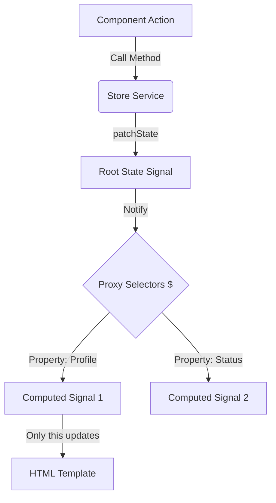

# 🔄 SignalStore: The Step-by-Step Flow

This document explains exactly how data flows from your **Service** to your **Component** using our new `SignalStore` system.

---

## 🛤️ The 5-Step Lifecycle

### Step 1: Define the "Shape" (The Interface)
First, we tell TypeScript exactly what data our store will hold. This ensures you never make a typo.

```typescript
export interface UserState {
  profile: any;
  status: 'loading' | 'loaded' | 'error';
}
```

### Step 2: Initialize the Engine (`super`)
When your service starts, it calls `super(initialValue)`. 
*   **What happens inside?** The base class creates a single `WritableSignal` to hold everything.
*   **The Magic Part**: It also starts a **Proxy**. This Proxy "watches" your interface and waits for you to ask for a signal.

```typescript
@Injectable({ providedIn: 'root' })
export class UserStore extends SignalStore<UserState> {
  constructor() {
    super({ profile: null, status: 'loaded' });
  }
}
```

### Step 3: The Component Asks for Data (`store.$`)
When your component needs data, it uses the `$` property.
*   **Flow**: `Component` -> `Store.$` -> `Proxy` -> `Computed Signal`.
*   **Result**: You get a **Readonly Signal** that is perfectly synced to only that one property.

```typescript
// Component Code
user = this.userStore.$.profile; // The Proxy creates this signal instantly!
```

### Step 4: Trigger an Action (Updating State)
When something happens (click, API call), you call a method in your Store.
*   **The Logic**: You use `patchState`. 
*   **Flow**: `Component` -> `Store Method` -> `patchState` -> `Signal.update()`.

```typescript
// Store Method
updateUser(newData: any) {
  this.patchState({ profile: newData }); // Only 'profile' changes, other data stays same.
}
```

### Step 5: The Reaction (UI Update)
The moment `patchState` finishes, Angular Signals take over.
*   **Granular Update**: If you updated `profile`, ONLY the parts of the HTML using `user()` re-render. 
*   **Efficiency**: The rest of the page—and even other signals in the same store—remain untouched.

---

## 📊 Visual Flowchart



---

## 💡 Why this is simple:

1.  **You write the state once** (Step 1).
2.  **You never write selectors** (The `$` handles Step 3 automatically).
3.  **You update like a standard object** (Step 4).
4.  **Angular handles the rest** (Step 5).

## 🚀 Pro Tip: The `connect()` shortcut
If you have an API call (Observable), you can skip Step 4 entirely:
```typescript
// Inside Store Constructor
this.connect('profile', this.userService.getInfo()); 
```
*   **Flow**: `API Response` -> `connect` -> `patchState` -> `UI Update`.
---

## 🎯 Basic Example: The Counter Store

Here is a complete, minimal example to see the loop in action.

### 1. Create the Store (`counter.store.ts`)
```typescript
export interface CounterState {
  count: number;
  lastAction: string;
}

@Injectable({ providedIn: 'root' })
export class CounterStore extends SignalStore<CounterState> {
  constructor() {
    super({ count: 0, lastAction: 'None' });
  }

  // Action: Increment
  inc() {
    this.patchState((s) => ({ 
      count: s.count + 1, 
      lastAction: 'Incremented' 
    }));
  }

  // Action: Decrement
  dec() {
    this.patchState((s) => ({ 
      count: s.count - 1, 
      lastAction: 'Decremented' 
    }));
  }
}
```

### 2. Use in Component (`counter.component.ts`)
```typescript
@Component({
  template: `
    <div>
      <h2>Count: {{ count() }}</h2>
      <p>Status: {{ status() }}</p>
      
      <button (click)="store.inc()">+</button>
      <button (click)="store.dec()">-</button>
    </div>
  `
})
export class CounterComponent {
  constructor(public store: CounterStore) {}

  // The Magic part: Automatic selectors!
  count = this.store.$.count;      // Link to 'count'
  status = this.store.$.lastAction; // Link to 'lastAction'
}
```

---

## 🏗️ Technical Deep-Dive: The "Magic" Proxy
Inside `signal-store.ts`, we use a JavaScript **Proxy**. 

When you type `store.$.something`, the Proxy does this:
1. It intercepts the request for "something".
2. It calls `computed(() => this.state().something)`.
3. It hands you back that computed signal.

This means you get **infinite selectors for free** without writing a single line of extra code!

